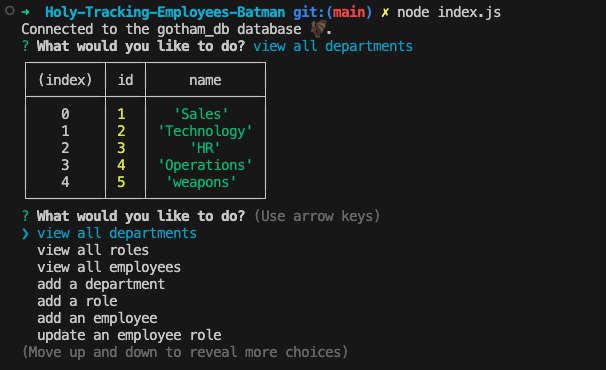

# Holy Tracking Employees, Batman!!!!

## Description
Having a content management system to keep track of employees is a necessity for any business, large or small. I have created a command-line application using Inquirer and MYSQL2 that allows users to view and add departments, roles, and employees and update an employee role. Here, we will be using Gotham_db, a database preferred by masked bat-themed vigilantes.

This project challenged me to use mysql2 for the first time to create sql queries as well as integrate inquirer data into the queries. I'd never worked with multiple tables before, and I noticed myself having to refer to visual tables in MySQLWorkbench to keep track of how one table was connected to another. 

I have a habit leftover from previous schooling of trying do everything by myself, using just the class materials or outside resources like W3Schools. This project emphasized the importance of conducting more extensive outside research like referencing working applications that previous developers have made and asking peers for help when I'm stuck debugging or confused about a concept. 

In the future, I would like to add a "delete" role, employee, or department functionality. I would also like to use the separation of concerns principle to organize my data into separate files for a cleaner interface. 

Link to video demo: https://drive.google.com/file/d/16Bg39HdiqlPZpZat-BQbcplqBcPCeBZh/view?usp=sharing

## Installation
1. Copy the SSH key in my GitHub repo and paste `git clone <SSHKEY>` in your terminal to create a local copy on your computer\
OR
2. Download the zip file and manually copy the files to your computer
3. Install node by copying and pasting the code `npm init -y` in your terminal
4. Install the inquirer package by running `npm i inquirer@8.2.4` in your terminal
5. Install the mysql2 package by by running `npm i mysql2` in your terminal

## Usage
1. Open the index.js file in your terminal\
*Note: Make sure you have the starter code installed first!
2. Run `
3. Run `node index.js` to start the application 
4. Type in answers to the questions and use the arrow keys to select answer options when applicable
5. You can exit the inquirer prompt completely by running `^c` in your terminal 

## Credits 
- [Inquirer Package](https://www.npmjs.com/package/inquirer/v/8.2.4)
- [mysql2 Package](https://www.npmjs.com/package/mysql2?activeTab=readme)
- [W3Schools](https://www.w3schools.com/sql/sql_autoincrement.asp)
- [Coding Insight](https://codingsight.com/how-to-create-table-with-multiple-foreign-keys-and-not-get-confused/#:~:text=You%20can%20use%20the%20FOREIGN,foreign%20key%20to%20reference%20it.) for how to format the foreign key
- [StackOverflow](https://stackoverflow.com/questions/1435177/why-does-this-sql-code-give-error-1066-not-unique-table-alias-user) for how to reference an alias name
- [W3Schools](https://www.w3schools.com/js/js_switch.asp)
- [W3Schools](https://www.w3schools.com/sql/sql_ref_is_null.asp)
- [W3Schools](https://www.w3schools.com/jsref/jsref_split.asp)
- [W3Schools](https://www.w3schools.com/sql/sql_update.asp)
- [Mozilla](https://developer.mozilla.org/en-US/docs/Web/JavaScript/Reference/Global_Objects/Array/map)
- Bootcamp tutor Wesley Clements helped me add the auto increment keyword
- TA Ian Darland helped me edit my query to get the manager id
- Classmate Jessica Saddington helped me create the map method for getting the department list to input into the inquirer choices array

## License
MIT License

